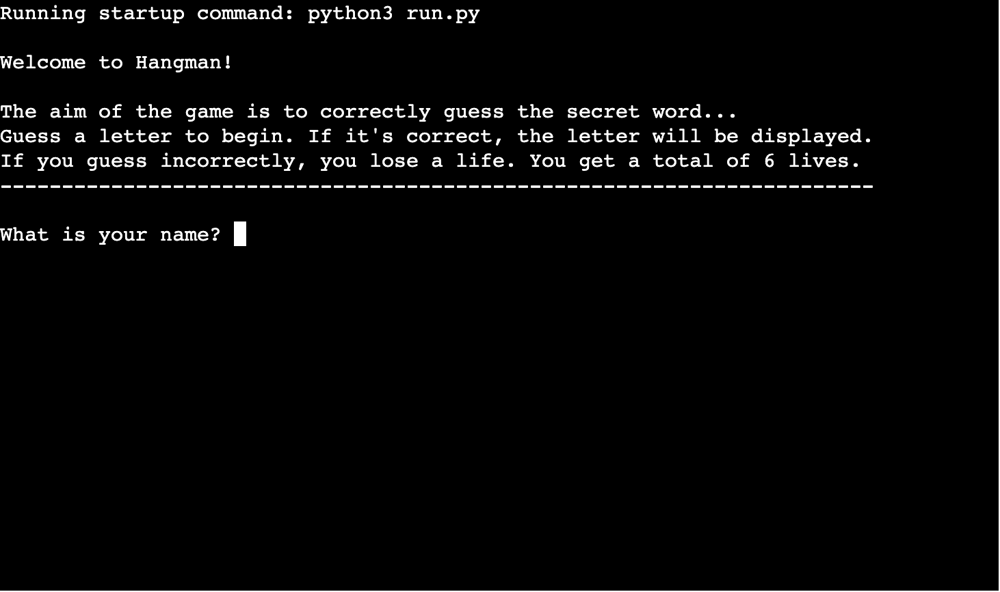
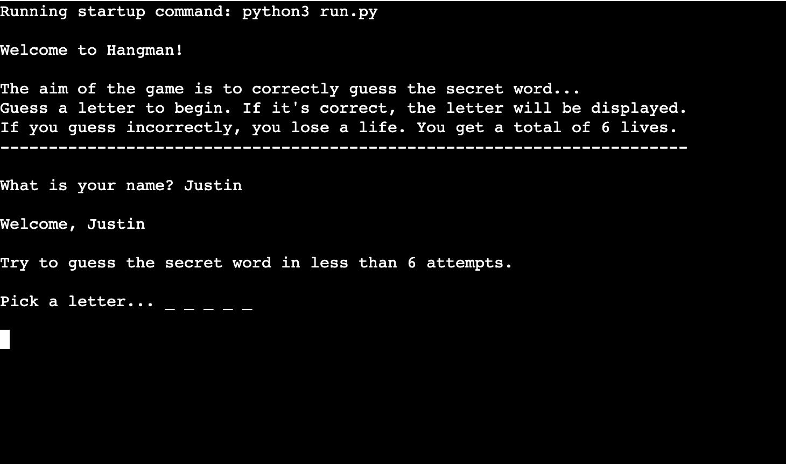
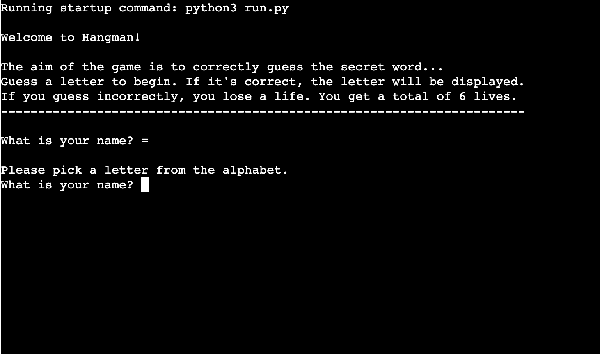
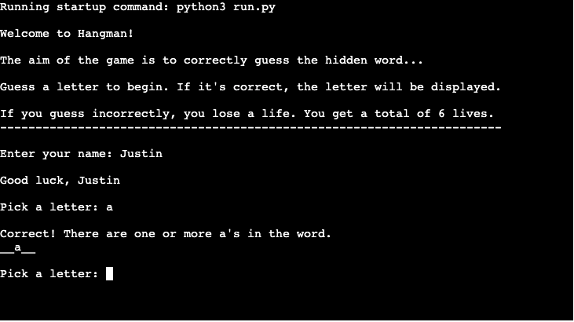
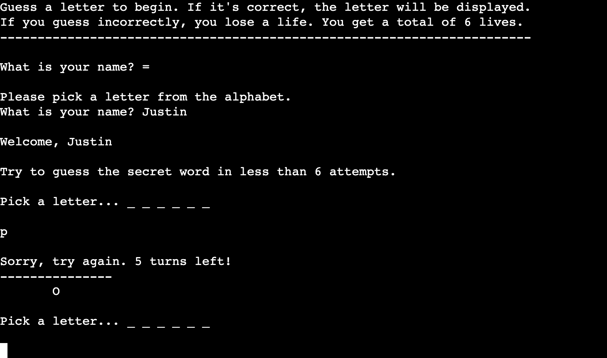
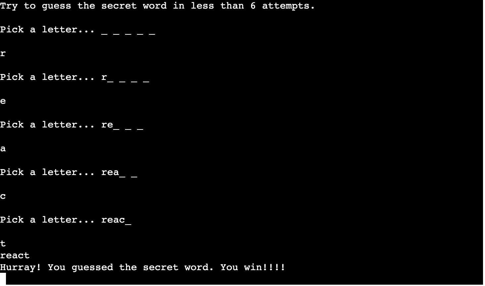
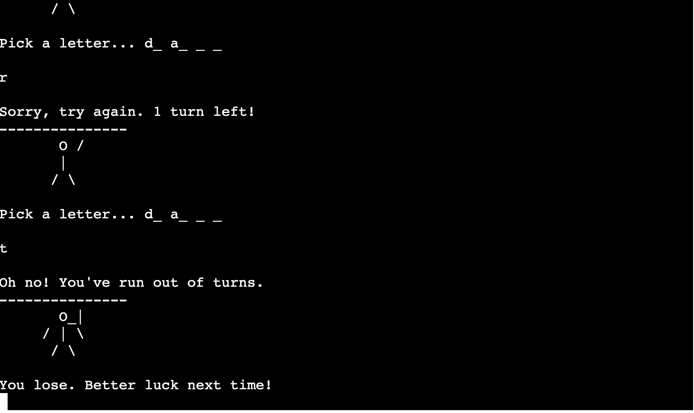

# Hangman
Hangman is a Python terminal game, which runs in the Code Institute mock terminal on Heroku. 

Users can try to guess the hidden word before running out of lives by guessing one letter at a time. 

The link to the live version of my project can be found [here](https://digitilley-hangman.herokuapp.com/)

## **How To Play**

The aim of hangman is to guess a hidden word by selecting 1 letter at a time. The player has a limited number of guesses to guess the word, failure to pick a letter that's in the hidden word results in the player losing a "life". In this game, the player has 6 lives before losing the game. If the player guesses the word before losing all of their 6 lives, they win the game. 

You can find more info on hangman the game [here](https://en.wikipedia.org/wiki/Hangman_(game))

## **Features**

### Existing Features
-   Welcome message, rules and personalised name input

-   After the player inputs their name, they're greeted with a "Welcome" message before being asked to select a letter.

- If a user selects a character that isn't a letter in the alphabet, the following error will be displayed:

- If the user correctly guesses a letter that's in the hidden word, the following is displayed:

- If the user guesses an incorrect letter, a countdown is displayed to show how many lives they have left, along with the following message:

- If the player correctly guesses the word, a congratulatory message is displayed: 

- If the player runs out of lives, the following message will be displayed: 

## **Future Features**
-   Visible hangman model
-   Larger selection of words to be stores in google sheets and integrated via API
-   Scoreboard so that the user can see how many correct and incorrect games they play

# Testing
I have manually tested this project by doing the following
- Passed the code through PEP8 linter and confirmed there are no problems
- Tested in my local terminal and the Code Institute Heroku terminal

# Bugs
Solved Bugs
- When I wrote the project I encountered issues where I'd added too many characters to my strings. I wanted to ensure the game was personalised and included name inputs, so had to shorten my code as a result.
- I also had missing whitespace around an operator within my code

# Remaining Bugs
- No bugs remaining

# Validator Testing
- PEP8
    - No errors were returned from PEP8online.com

# Deployment
This project was deployed using Code Institute's mock terminal for Heroku.
- Steps for deployment:
    - Fork or clone this repository
    Create a new Heroku app
    Set the buildbacks to Python and NodeJS in that order
    Link the Heroku app to the repository
    Click on **Deply**

# Credits
- Code Institute for the deployment terminal
- Wikipedia for the details of the hangman game
- Stack Overflow for the resource declared in my code
- My Code Institute tutor, Rueben

 

